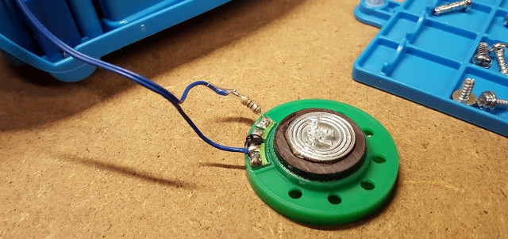
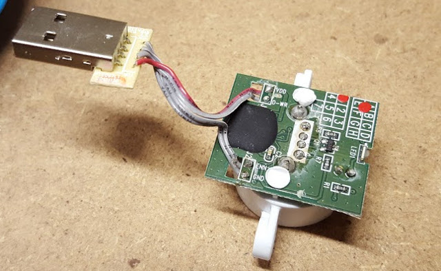
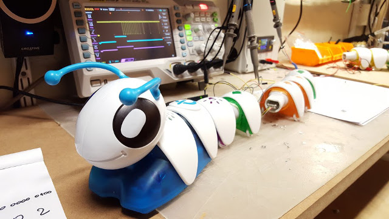

# Hacking the Fisher-Price Code-A-Pillar 

[Code-a-Pillar](http://fisher-price.mattel.com/shop/en-us/fp/think-learn/code-a-pillar-dkt39) is a cute programmable caterpillar robot for sold for 3-6 years old kids. Kids love it and it can be used in (pre-)schools to teach pupils some basic programming. I think it is a great toy and can be a good educational tool. 

The robot is programed by the sequence of tail blocks that are connected to the head. The basic pack include 8 blocks: 3 to go forward, 2 to turn left, 2 to turn right and 1 to make music. There are expansion packs that include more commands and according to the documentation, the caterpillar will work with up to 16 blocks connected. The blocks are connected together by USB connectors. 

How does it work? How does it knows which blocks are connected? in which sequence? Can we create our own blocks? Could we add a Bluetooth block to send our own programs?

Let's find out! :-)

# Before we start: fixing the sound

Out of the box many people have complained that it is too loud. I can confirm. It did not take more than a few minutes for me to get annoyed by how loud it is. Unfortunately, there is no volume control or mute button but this is a very easy fix. 

1. Open the body: remove the batteries, the 4 screws on the bottom and the body opens. It is not possible to get the top and bottom completely apart because of wiring but it opens enough to access the speaker.
2. Remove the two screws that hold the speaker in place and pull the speaker out.
3. Solder a resistor in series with the speaker. A 100 Ohm resistor gives good results.
4. Put everything back together.

If you want to kill the sound completely, you can just cut one of the wires to the speaker and that would do the trick but I think it is a pity because the kids love the sounds it makes. You could of course add a switch to be able to turn the sound on and off or a potentiometer to adjust the volume (probably a 1K audio pot would be a good choice).

## Hardware for the head/body

The head/body of the caterpillar is 3-wheeled robot with 2 steering wheels in the front and one traction wheel in the back. I have not taken it to bits and looked at everything but here what it seems to be made of:

- Two DC motors, one for traction on the back wheel and one for steering on the front wheels,
- Optical encoders for both the front steering wheels and the back wheel,
- An RGB LED in the head,
- At least 2 switches which are activated when the head bumps into stuff. It is used as a bumper to stop the robot when there are obstacles.
- A sound chip playing different samples through the speaker
- An IMU: at least one gyroscope which is used to measure angles when turning and some accelerometers seem to be used to figure out if it is up-right or not. For the up-right part it could also be a reed switch but since there is definitely a gyro, my guess is that it includes a cheap 6 axis IMU. 
- A USB connector to plug in the tail elements that make up the program.

## Hardware for the tail blocks

Each of the tail block include 2 USB connectors, a microcontroller and an LED. The microcontroller is under the black blob on the picture bellow. There is no way to tell what it is exactly.

## Wiring and communication protocol

The head and the tail blocks are connected through USB connectors, this allows for 4 wires to be connected. On the PCB the 4 connections are labeled:

- GND (for ground), 
- VDD (for the positive supply, which is about 4.5V), 
- D-WR (for what seems to be a sort of 1-wire bus) and 
- EN (probably for "Enable").

The D-WR connection is directly connected through all the tail element, it is really a bus. However the EN pin is not connected through the blocks, it is used to be able to figure out in which order the blocks are connected on the bus.

After looking at the signals on the scope, I have written a small arduino program to sniff the messages echanged on the data bus. It is not complete yet and the timing needs to be improved but a first version is in the Sniff-A-Pillar folder together with some examplainations of how it works.