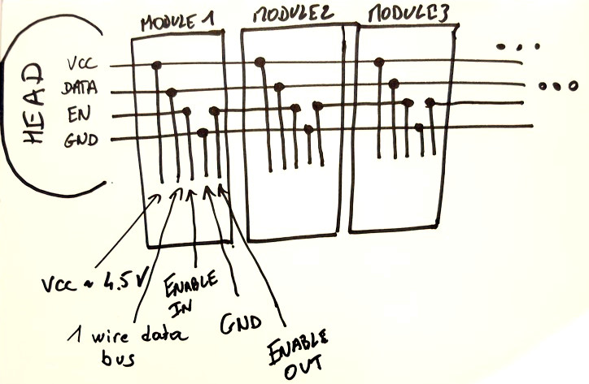
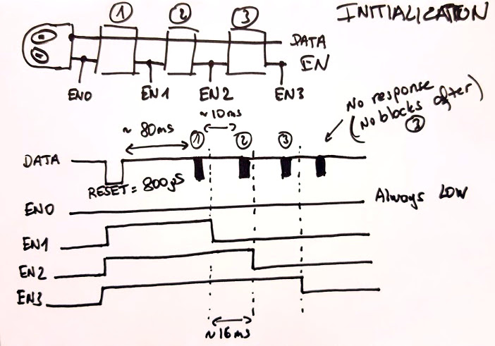

# Sniff A Pillar

The goal is to make an arduino program to sniff and understand the protocol used on the bus between the blocks.

The currnent version is preliminary but already allows to see quite a lot of what is going on. It is written for an Arduino UNO (ATMega328 at 16MHz). It is meant to sniff the 1-wire bus of the Code a Pillar and output the messages on the Arduino serial port (at 115200 bps). The 1-wire bus should be connected to the INT0 pin of the Arduino Uno (it corresponds to digital pin 2).

## Example initialization sequence

Captured using the Arduino SniffAPillar:

    RESET
    1 1 0 OK [ DISCOVER @1] - 8 0 OK [ MUSIC ]
    2 1 0 OK [ DISCOVER @2] - 1 0 OK [FORWARD]
    3 1 0 OK [ DISCOVER @3] - 4 0 OK [ LEFT  ]
    4 1 0 OK [ DISCOVER @4] - 2 0 OK [ RIGHT ]
    5 1 0 OK [ DISCOVER @5] - 1 0 OK [FORWARD]
    6 1 0 OK [ DISCOVER @6] - FF FF ERR
    6 1 0 OK [ DISCOVER @6] - FF FF ERR
    6 1 0 OK [ DISCOVER @6] - FF FF ERR
    6 1 0 OK [ DISCOVER @6] - FF FF ERR
    0 6 0 OK  - 0 6 0 OK  - 0 6 0 OK  - 

## Tail modules

As far as I understand so far, the modules have a type and return a type value when they are initialized by the master:

- 1 : FORWARD
- 2 : TURN RIGHT
- 4 : TURN LEFT
- 8 : MAKE MUSIC

There are probably other codes for the additional blocks which can be purchased separately but I do not have them. In terms of commands, for now I have identified 5:
- DISCOVER (which is sent by the master to discover more blocks and provide them with an address). The module responds with its type ID.
- PING (which is used by the master to regularly ping the modules which are connected). The module responds with a 1 bit ack.
- Turn LED ON. The module responds with a 1 bit ack.
- Turn LED OFF. The module responds with a 1 bit ack.
- Blink LED. The module responds with a 1 bit ack.

## Notes

Some notes on how the elements are chained together:

Notes on how the enable pins are used after the initialization of the bus in order to compute the order of the modules:

