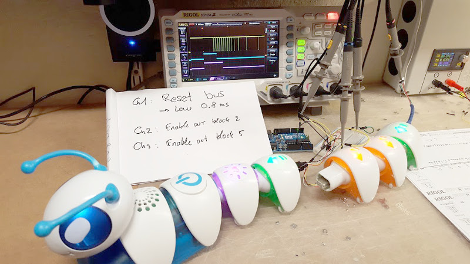
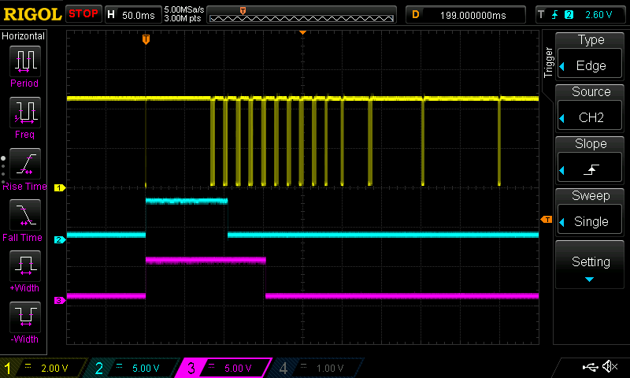
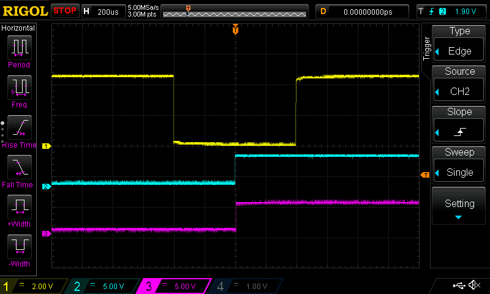
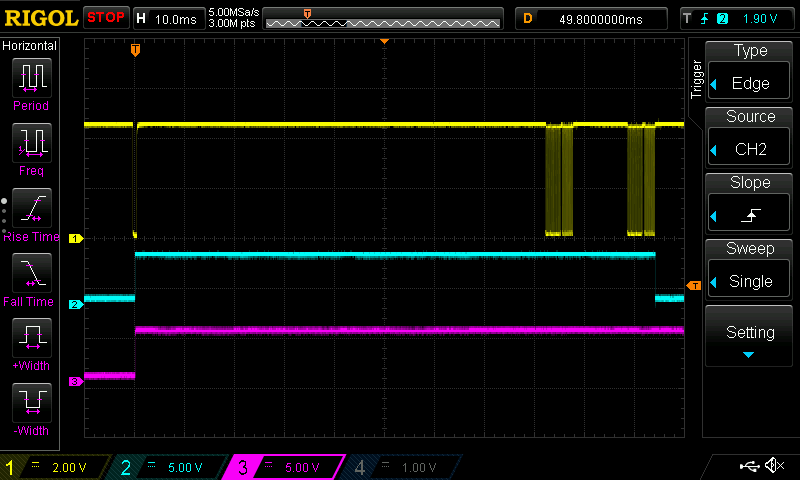
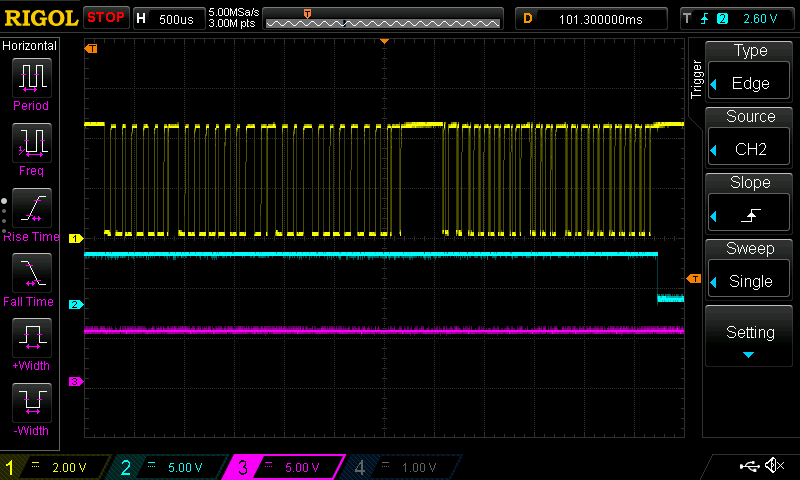
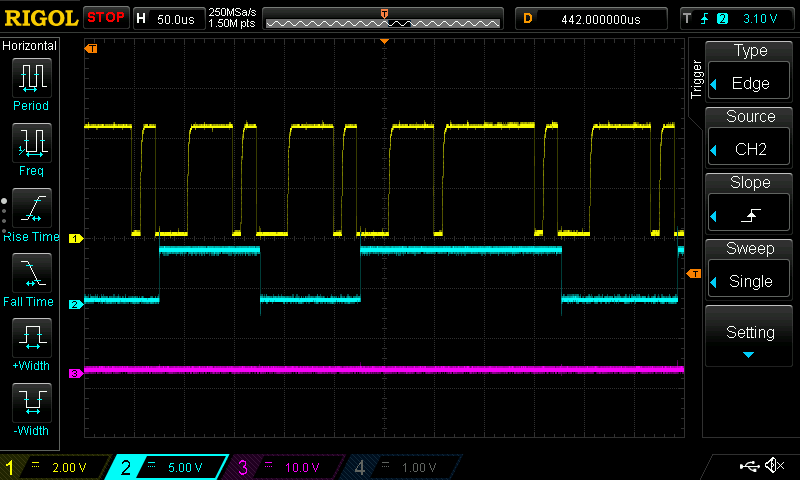

# Fisher-Price Code-A-Pillar Protocol Reverse Engineering

Since I could not find any documentation on what protocol is used, I just hooked up the scope to figure out what was going on. Here is the setup:

For this experiment, the catepillar tail is composed of 5 blocks. To probe the signals, a custom USB cable is used between block 2 and 3 and out block 5. Three channels of the scope are used:

- Ch1 (Yellow) is the one-wire bus shared by all blocks.
- Ch2 (Blue) is the "ENN" signal out block 2 and into block 3
- Ch3 (Pink) is the "ENN" signal out of block 5.

Here is how it look upon startup:

A reset pulse on the bus causes all the "ENN" lines to go high, except the one comming from the head. This is not shown on this experiment but probing the ENN signal between the head and the first block shows that it is ALWAYS low. On the screenshoot above channels 2 and 3 correspond to the outputs of block 2 and 5. After the "reset" pulse, packets are exchanged on the bus. The "ENN" line for block 2 goes low after 2 packets have been echanged and the "ENN" line out of block 5 goes low after 5 packets have been echanged. It thus seem that the "ENN" line is used in order to initialize the blocks in the order they are connected. Lets zoom in to see what is going on.

## Reseting the bus

To initialize the bus and trigger the initialization of the blocks in the order they are connected, the head (master of the bus) pulls the bus low:

As shown above the reset pulse has a duration of about 800µs. The "ENN" lines go high after about 400µs.

The head resets the bus:

- On power on and when it goes out of sleep
- When the button is pressed to start the program
- Whenever blocks are connected or dissconected
- After the en of execution of the program 

After the reset pulse, there is a pause of about 80ms and then packets start to be exchanged. 

## Data packets

Here is a closer look at the second packet:

The packets are composed of two distict sections: a command or request from the master followed by a response from one of the blocks. The encoding of the bits is similar to typical 1 wire protocols (see https://en.wikipedia.org/wiki/1-Wire).

In terms of the size, there see to by 28 bits in the request and 20 bits in the response. After looking at the data a bit closer, the 4 bits for the request and response are actually checksums. That means that in terms of payload, the request contains 3 bytes (24 bits) and the response 2 bytes (16 bits).

## Bits encoding

Like in typical 1-wire protocols, the master of the bus is handling bit clock both when it is writing on the bus and when the blocks (slave devices) are responding.

Here is how data looks when the master is writing:

The above shows the bits 0000 0011 0... Each low pulse is a bit. If the pulse is short (about 6-10us) it codes for a 1 and if the pulse if long (about 60us) it codes a 0. Each bit is about 100us long which makes the bitrate about 10kbps.

Here is how it looks when the blocks are responding (ignore the blue and pink traces, I do not remember what they were):

For each bit, the master pulls the bus low for about 6-10us. After that, if the bit is a 1, the slave does not do anything (and the bus remains high until the next bit) and if the bit is a 0 the slave pulls the line low for about 30us. In typical one-wire busses, the slave often starts to pull low while it is still pulled low by the master (within the first 6-10us) but in the case of the code-a-pillar, the bus come back high for another 10us before being pulled low by the slave.

On the figure above, the data is ...00010...

## Packets

Commands sent by the head are composed of 28 bits: 3 bytes of payload and a 4 bits checksum.

The 4-bits checksum seems to be a simple XOR for the 6 x 4 bits of the payload. This is to be verified since I have only looked at small values being sent. Here is the format of the packets:

	       Byte 1              Byte 2               Byte 3         (4 bits)
	+--------------------+-------------------+--------------------+-----------+
	|                    |                   |                    |           |
	|   Dest. Address    |     Command       |     Parameter?     | Checksum  |
	|                    |                   |                    |           |
	+--------------------+-------------------+--------------------+-----------+

	    0: Broadcast       0: ???                   ???
	                       1: DISCOVER
	    X: Target addr.    2: PING
	                       3: LED ON?
	                       4: LED BLINK?
	                       5: LED OFF?
	                       6: ALL OFF  

